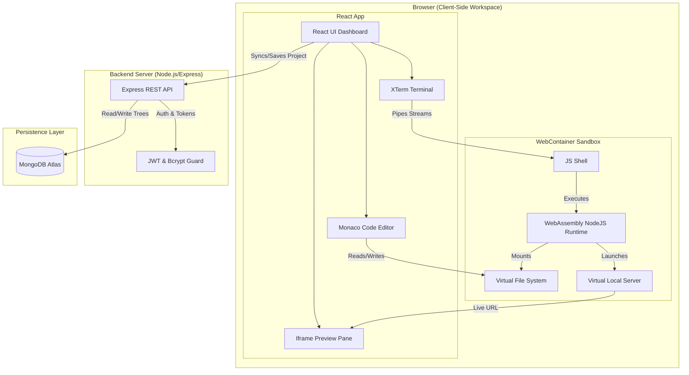

# 🚀 Next-Gen Web IDE: In-Browser Development Environment
### *Web-IDE - Assignment Submission*

A full-featured Web IDE running a complete, sandboxed Node.js development environment **entirely inside the browser**. Utilizing StackBlitz WebContainers, Monaco Editor, XTerm.js, and a robust Express/MongoDB backend, this platform enables users to write, run, terminal-interact, preview, and save full-stack web applications without installing a single local dependency.

---

## 🏛️ System Architecture

The application is structured as a **Decoupled Client-Server Architecture** where the client handles both the presentation layer and the virtualization of the Node.js execution runtime, while the backend acts as a stateless persistence and authentication layer.



### 1. The Frontend (Workspace Layer)
*   **React & Vite (Single Page Application)**: Built on React 19 for declarative component UI, using Vite for ultra-fast Hot Module Replacement (HMR) and Tailwind CSS v4 for modern, dark-themed responsive styles.
*   **Virtual Containerization (`@webcontainer/api`)**:
    *   Initiates a WebAssembly-based Node.js runtime inside a browser service worker context.
    *   Boots asynchronously via a custom React Hook wrapper (`useWebContainer`) that enforces a **singleton pattern** to prevent resource locks across hot-reloads.
    *   Mounts project files into a virtual filesystem in memory.
    *   **Background File Watcher Sync**: Subscribes to the root directory `/` recursively using `fs.watch` to listen for terminal-driven file and folder modifications. Employs a 300ms debounce loop and excludes `node_modules` and `.git` directories to guarantee low-latency React `fileTree` UI state updates without lagging.
    *   **Payload Optimization Filters**: Resolves database entity limits (`PayloadTooLargeError: request entity too large`) by ignoring generated directories (`node_modules/`, `dist/`) and any hidden system directories (e.g. `.git/`, `.vite/`) using `entry.isDirectory() && entry.name.startsWith('.')` checks, while cleanly preserving important configuration files like `.gitignore` or `.env`.
*   **Advanced Editor Pane (`@monaco-editor/react`)**:
    *   Embeds VS Code's editor engine in the browser.
    *   Integrates active file hooks to continuously flush code buffers to the WebContainer's virtual file system (`webcontainer.fs.writeFile`) dynamically.
    *   Performs file extension-based automatic language detection and syntax highlighting.
*   **Interactive Terminal Pane (`xterm` & `xterm-addon-fit`)**:
    *   Spawns a shell process (`jsh` - StackBlitz's JavaScript Shell) inside the container.
    *   Establishes bidirectional piping: standard output streams are written to the terminal viewport, and terminal data inputs (keystrokes) are piped directly to the container process writer stream.
*   **Live Preview Pane**:
    *   Hooks into the `server-ready` event triggered by the WebContainer.
    *   When the virtual Node.js process starts a server (e.g. Express, Fastify, or Node `http`), the preview pane dynamically updates its iframe source to point to the secure virtual local server proxy generated by the WebContainer.

### 2. The Backend (Persistence Layer)
*   **RESTful Express API**: Built with Node.js, Express (v5), and CORS support.
*   **MongoDB Atlas Database**: Stores users and user project documents (storing the exact virtual file tree as a JSON representation in a schema-compliant Mongoose model).
*   **State-of-the-Art Security**:
    *   Passwords are encrypted using modern `bcrypt` algorithms (10 salt rounds).
    *   Session management is secured via **JSON Web Tokens (JWT)**, which are sent via Authorization Bearer headers for protected resource routes.

---

## 🤖 AI Usage Strategy

This project was developed with a collaborative **AI-Assisted Pair Programming Strategy**. AI was treated as a senior principal architect and co-pilot to maximize code quality, performance, and structural layout:

1.  **Architecture & Design Strategy**: AI assisted in laying out the decoupling strategy between the client-side WebContainer execution and backend persistence. This minimized server CPU/memory utilization, moving execution to the edge.
2.  **WebContainer Bootstrap & Singleton Management**: Writing clean React hooks that boot the async WebContainer can be prone to race conditions (e.g. booting the container multiple times due to React StrictMode or hot-reloading). AI helped configure the singleton pattern `let webcontainerInstance = null` and coordinate its async setup sequence perfectly.
3.  **Real-time IO Piping**: AI was used to draft clean stream handling, piping the WebContainer's raw output `ReadableStream` into `Xterm.js` and managing the terminal's disposal lifecycle to prevent serious memory leaks.
4.  **Security Configurations**: AI aided in writing secure Express controllers, structuring JWT token signs and verification middlewares, and ensuring MongoDB credentials/tokens are never committed by advising on environment setups and drafting robust `.gitignore` rules.

### 📋 Chronological Prompt & Instruction Sequence

During the development process, the following sequential instructions were used to steer the AI coding agent's implementation of features, integrations, and optimizations:

1. **Basic IDE Layout & Core Editor/Terminal Components**
   > *Prompt:* "i am building a browser based ide like stackblitz. we have to Build a browser IDE-like environment where users can: Create, edit, and delete files and folders. Run and preview projects live. Persist project state across sessions. Install and use external npm packages. Experience near real-time updates within the sandbox. we are first implementing the frontend. what we are aiming for here is a layout like vs code or stackblitz where there will be file explorer on the left and the code editor window on the right or center, a collapsable terminal window at the bottom. install and integrate @monaco-editor/react for the code editor and XTerm.js for the terminal"
2. **Live Preview Panel Integration**
   > *Prompt:* "add a collapsable, drag to extend preview panel at the right side of the main code editor. so now the layout is like this left colums file explorer then center main editor window below the editor window a collapsable terminal window and on the right side of the main code editor a live preview panel."
3. **WebContainer Virtualization Engine Implementation**
   > *Prompt:* "now I need to integrate the `@webcontainer/api` to make this functional. Please implement this step-by-step, ensuring we don't break the existing UI. 
   1. Dev Server Headers: First, update my vite.config.js to include the required Cross-Origin-Embedder-Policy and Cross-Origin-Opener-Policy headers so WebContainers can boot. 
   2. WebContainer Hook: Create a custom hook or Context to boot the WebContainer singleton. It should only boot once per page load. Mount a basic initialFiles object (containing a package.json and index.js) upon booting. 
   3. Editor Sync: Update my Monaco editor component so that its onChange event writes the new file content directly to the WebContainer using webcontainerInstance.fs.writeFile(). 
   4. Terminal Piping: This is the critical part. Update my XTerm component to start a jsh shell process on the WebContainer. You must pipe xterm.onData into the shell process input, and read the shell process output stream to write back to the Xterm UI using term.write(). 
   5. Preview URL: Add a listener for the WebContainer's server-ready event. Store the emitted URL in state and pass it to an iframe to act as the live preview window. 
   Let's do Step 1 and 2 first. Show me the code for the Vite config and the initialization hook."
4. **Filesystem State Sync & Sidebar Explorer C.R.U.D Actions**
   > *Prompt:* "Currently, the file tree is just a static visual component. I need you to make it fully functional and integrated with the WebContainer API. Here is what we need to do step-by-step: 
   1. File State Synchronization: Move or define the FileSystemTree object state in our main layout component (or a context) so both the Explorer sidebar and the Monaco Editor can read/write to it. When a user clicks a file in the explorer (e.g., App.jsx), it should switch the active model/content in our Monaco Editor. 
   2. C.R.U.D Actions in Sidebar: Update my sidebar file explorer component to allow creating new files/folders, and deleting files/folders. When an action happens, perform a "double-write": update the local React file tree state (so the UI re-renders), and immediately call the matching WebContainer filesystem API method (webcontainerInstance.fs.writeFile, mkdir, or rm). 
   3. Terminal Cleanup (Quick Fix): I noticed raw ANSI escape codes (like \x1b[1;34mBooting...) are printing out as literal text strings in my terminal panel. Please make sure the XTerm instance is processing raw stream chunks via terminal.write() correctly instead of treating it as a standard text primitive string, and ensure the xterm-addon-fit handles resizing. Let's start by modifying the main layout wrapper and the file explorer component to handle the file state and creation logic. Show me the code modifications."
5. **Backend Integration & CORS Setup**
   > *Prompt:* "i have added my backed in the /back folder i wantyou to integrate frontend with backend. deal with the cors and see that thay are hooked up nicely. you can make the necessary changed to the backend only if needed."
6. **File Sync Payload Optimization**
   > *Prompt:* "The file watcher is working, but when trying to save, the backend crashes with a `PayloadTooLargeError: request entity too large`. This is because the recursive file reader is reading and sending the entire `node_modules` directory over the network to our Express API. Please update the recursive disk-reading function on the frontend to explicitly IGNORE the `node_modules` folder and any hidden system directories (like `.git`) when building the React `fileTree` object. We only want to save source files like `src/`, `public/`, `package.json`, `vite.config.js`, etc."
7. **Production Domain & Deployment Integration**
   > *Prompt:* "this is my render server base url : https://web-ide-4.onrender.com and this is my vercel app link : https://web-ide-gamma.vercel.app/ integrate these two"

---

## ⚖️ Technical Tradeoffs

During development, several crucial engineering decisions were made, balancing tradeoffs to ensure optimal developer experience and performance:

| Decision | Pros | Cons | Mitigation / Resolution |
| :--- | :--- | :--- | :--- |
| **Browser Execution (WebContainers) vs. Server Containers (Docker)** | • Zero server execution costs.<br>• Infinite scale capacity.<br>• absolute isolation (no arbitrary code vulnerabilities on server). | • Requires strict security headers (`COOP`/`COEP`).<br>• Boot time takes a few seconds.<br>• Limited by browser memory limits. | Adopted StackBlitz's WebContainers which handles Wasm-level system calls safely, keeping server footprint down to simple static hosting. |
| **Dynamic Auto-Save-to-Container vs. Debounced Save** | • Instant local terminal response when user runs code.<br>• Fits standard editor behaviors. | • Frequent filesystem writes can lead to small performance blips for huge files. | Implemented synchronous memory-mapped writes for files inside Monaco onChange, keeping UI response immediate and lag-free. |
| **Monolithic Workspace State vs. Lightweight React Context** | • Single source of truth is easy to trace.<br>• Fits nicely in standard React state. | • Prop drilling to nested panes (Sidebar, Terminal, Editor). | Modularized features into standard React Custom Hooks (`useWebContainer`) and structured layout context blocks (`AuthContext`) to decouple logic. |

---

## ⚠️ Known Limitations

1.  **Strict Security Header Requirements**:
    *   WebContainers require a highly secure context. The server serving the frontend **MUST** headers:
        ```http
        Cross-Origin-Opener-Policy: same-origin
        Cross-Origin-Embedder-Policy: require-corp
        ```
    *   Without these, `SharedArrayBuffer` is blocked by the browser, and the IDE cannot boot.
2.  **Browser Sandbox Scope & C++ Addons**:
    *   WebContainers support standard JavaScript Node.js modules. However, modules that compile native C++ addons (e.g., node-gyp builds) are **not** supported, as the browser cannot execute arbitrary machine-code binaries outside the WebAssembly sandbox.
3.  **Single Origin Service Worker Conflict**:
    *   If a user opens the IDE in multiple browser tabs simultaneously, they might face conflict states as both instances try to control and rewrite files to the registered Origin Service Worker scope.
4.  **Database / Network Isolation**:
    *   Node servers running inside the WebContainer cannot bind to arbitrary host network interfaces outside the local browser loopback interface. Any external database access (e.g. Mongo, MySQL) must go over public APIs/HTTP, rather than direct TCP socket connections.

---

## 🛠️ Installation & Setup Guide

Follow these steps to run the complete workspace locally.

### Prerequisites
*   **Node.js**: `v18.x` or higher
*   **MongoDB**: An active MongoDB Atlas cluster or a local MongoDB database instance.

### 1. Backend Configuration & Launch
1.  Navigate into the backend directory:
    ```bash
    cd back
    ```
2.  Install dependencies:
    ```bash
    npm install
    ```
3.  Set up environment variables: Create a `.env` file in the `back/` folder (or edit `server.js` directly to adjust the URI):
    ```env
    PORT=3000
    MONGO_URI=your_mongodb_connection_string
    JWT_SECRET=your_jwt_secret_key
    ```
4.  Start the dev server:
    ```bash
    npm run dev
    ```

### 2. Frontend Configuration & Launch
1.  Navigate to the frontend directory:
    ```bash
    cd ../front
    ```
2.  Install dependencies:
    ```bash
    npm install
    ```
3.  Start the Vite dev server:
    ```bash
    npm run dev
    ```
4.  Open the workspace in your browser at `http://localhost:5173`.
